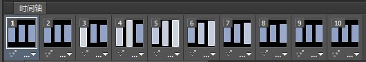

p-loading
=========

css3 loading...


祝愿 [demo](https://paper.github.io/p-loading/p-loading.htm) 越来越多 :D

##说明

###Fb

1. 首先下载fb的loading图
2. 导入ps进行分析，打开时间轴（窗口 -> 时间轴），可以看到这个图
3. 间隔是0.08秒，10帧。也就是说，动画总时间为0.8秒，所以：
    ```
    animation-duration: 0.8s
    ```

4. 第1帧，大家都没动。第2帧，第一个方块开始动了，从第3帧可以看出，中间的方块也准备动了，所以：  
    第2个方块
    ```
    animation-delay: 0.08s;
    ```
    第3个方块
    ```
    animation-delay: 0.16s;
    ```

5. 第3帧，第一个格子达到顶峰，所以：
    ```
    30% {
        height:30px;
        top:1px;
        background-color:rgb(205, 211, 221);
        box-shadow: 0 0 1px rgba(255, 255, 255, 1) inset;
    }
    ```

6. 第7帧，回到初始状态，并一直延续到最后，所以：
    ```
    70%, 100% {
        height:20px;
        top:6px;
        background-color:rgb(144, 162, 198);
    }
    ```

7. 贝塞尔曲线，比较麻烦。下面有参考链接，其实 `ease-in` 也差不多，但不断的调试发现 `cubic-bezier(1, 0.1, 1, 0.5)` 更接近一些（纯粹个人感觉），所以使用了这个值 :D

######参考
1. [fb loading gif](./fb/loading-fb.gif)
2. https://developer.mozilla.org/en-US/docs/Web/CSS/timing-function
3. http://www.sitepoint.com/css3-transitions-cubic-bezier-timing-function/?utm_source=tuicool

###Weixin Video

做这个，死了不少脑细胞。。。。  
一开始我知道圆、半圆、1/4圆好做，但任意弧度呢（有点像一小块披萨）？？

1. 先作一个透明的，右半圆容器 `A`，设置 `overflow:hidden`
2. 再在这个 `A` 内做一个左半圆 `B`，让 `B` 和 `A` 的垂直边缘贴合，形成一个圆 `O`
3. 设置 `B` `transform-origin: right center 0;`，让 `B` 围绕 `O` 的圆心旋转
4. 这样看起来，`B` 就会慢慢出现在 `A` 里面，并且占满整个 `A` （就是动画的前一半）
5. 后一半的动画，你应该想到了。同样的道理，设置左半圆容器和内半圆。只是左半圆动画的时候，右半圆保持静态。
6. 这样，你就看到了完整的动画了。 :D


